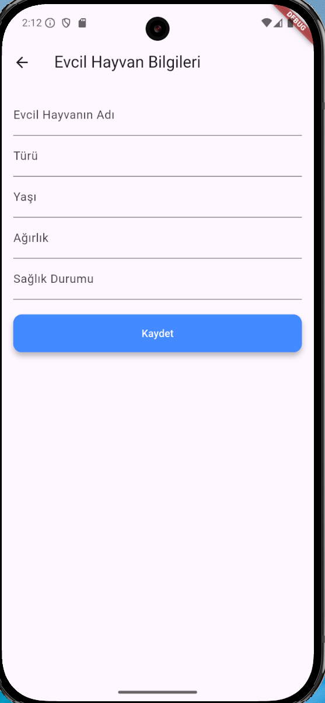

# Evcil Hayvan Takip Uygulaması

Bu proje, evcil hayvanların bilgilerini ve yemek düzenlerini takip etmek için geliştirilmiş bir mobil uygulamadır. Uygulama, Flutter framework'ü kullanılarak geliştirilmiştir ve çeşitli teknolojiler ve yapılar kullanılmıştır.

## Kullanılan Teknolojiler ve Yapılar

### Flutter
- **Flutter**: Google tarafından geliştirilen açık kaynaklı bir UI yazılım geliştirme kitidir. Hem Android hem de iOS platformlarında çalışabilen nativ benzeri uygulamalar oluşturmak için kullanılır.
- **Dart**: Flutter uygulamalarını geliştirmek için kullanılan programlama dilidir.

### Veritabanı
- **SQLite**: Uygulama, yerel veritabanı yönetimi için SQLite kullanır. SQLite, hafif ve gömülü bir SQL veritabanı motorudur.
- **sqflite**: Flutter uygulamalarında SQLite veritabanını kullanmak için kullanılan bir Flutter eklentisidir.

### Durum Yönetimi
- **StatefulWidget** ve **StatelessWidget**: Flutter'da durum yönetimi için kullanılan temel widget türleridir. StatefulWidget, durum değişikliklerini yönetirken StatelessWidget, değişmeyen durumlar için kullanılır.

### UI Bileşenleri
- **MaterialApp**: Flutter'da Material Design prensiplerine uygun uygulamalar oluşturmak için kullanılan widget'tır.
- **Scaffold**: Uygulamanın temel düzenini oluşturmak için kullanılan widget'tır. AppBar, Drawer, BottomNavigationBar gibi bileşenleri içerir.
- **AppBar**: Uygulamanın üst kısmında yer alan başlık çubuğudur.
- **BottomNavigationBar**: Uygulamanın alt kısmında yer alan ve sayfalar arasında geçiş yapmayı sağlayan navigasyon çubuğudur.
- **ElevatedButton**: Kullanıcı etkileşimleri için kullanılan yükseltilmiş butonlardır.
- **Image.asset**: Uygulama içindeki varlıkları (resimler gibi) görüntülemek için kullanılır.


### Diğer
- **FutureBuilder**: Asenkron işlemleri yönetmek ve sonuçlarını UI'da görüntülemek için kullanılan widget'tır.

## Proje Yapısı

- **main.dart**: Uygulamanın giriş noktasıdır. MaterialApp ve temel navigasyon yapısı burada tanımlanır.
- **database.dart**: SQLite veritabanı işlemlerini yöneten sınıflar ve fonksiyonlar burada tanımlanır.
- **PetFormPage**: Yeni evcil hayvan ekleme sayfasıdır.
- **AddPetForm**: Evcil hayvan bilgilerini eklemek için kullanılan form sayfasıdır.
- **AddMealPlanForm**: Evcil hayvanın yemek düzenini eklemek için kullanılan form sayfasıdır.
- **HomePage**: Kayıtlı evcil hayvanların listelendiği ana sayfadır.
- **PetDetailPage**: Evcil hayvanın detaylı bilgilerini ve yemek düzenini görüntülemek için kullanılan sayfadır.

## Kurulum ve Çalıştırma

1. **Flutter SDK**'yı kurun: [Flutter Kurulumu](https://flutter.dev/docs/get-started/install)
2. Projeyi klonlayın:
   ```sh
   git clone https://github.com/kullaniciadi/evcilhayvantakip.git





